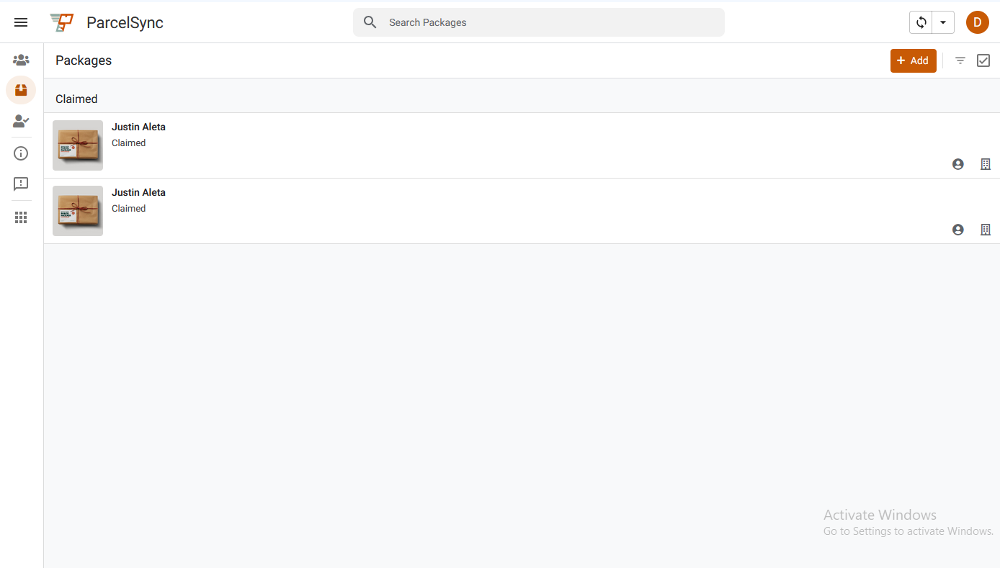
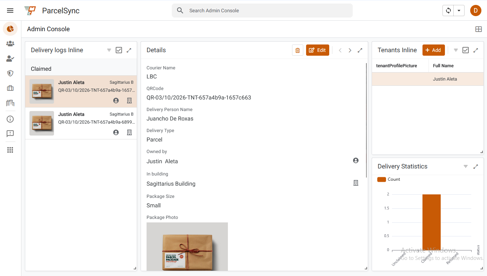
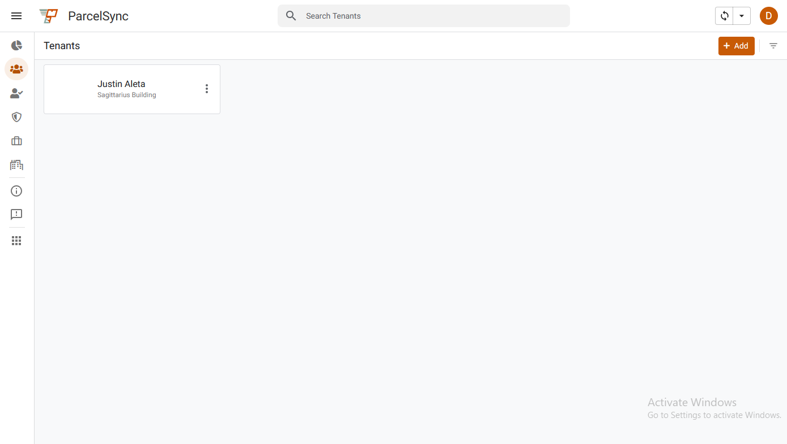
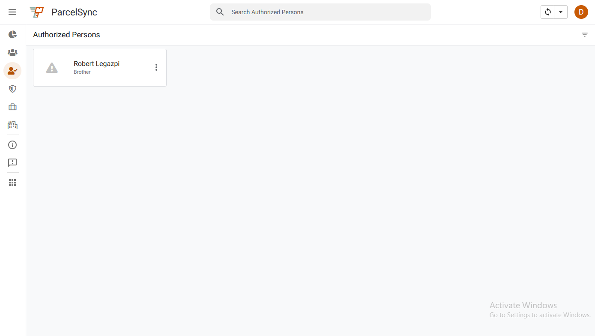
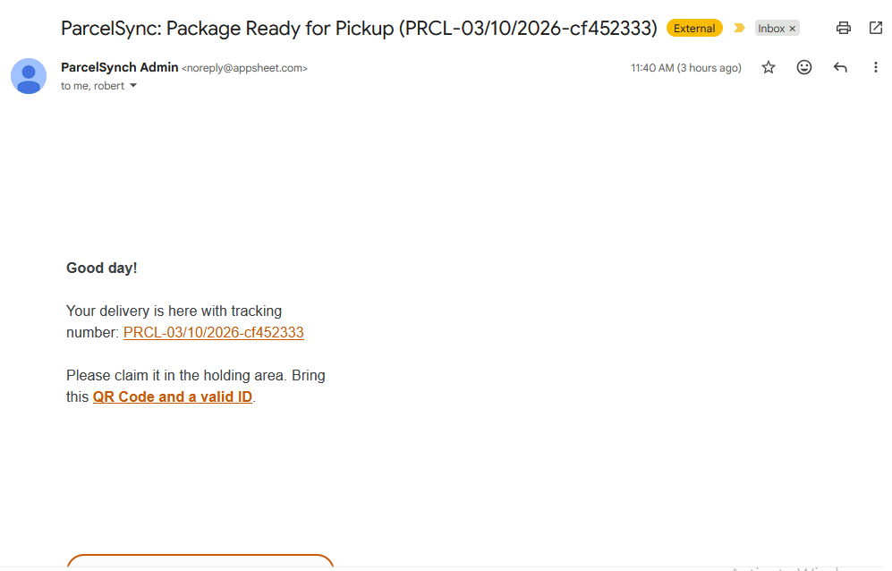
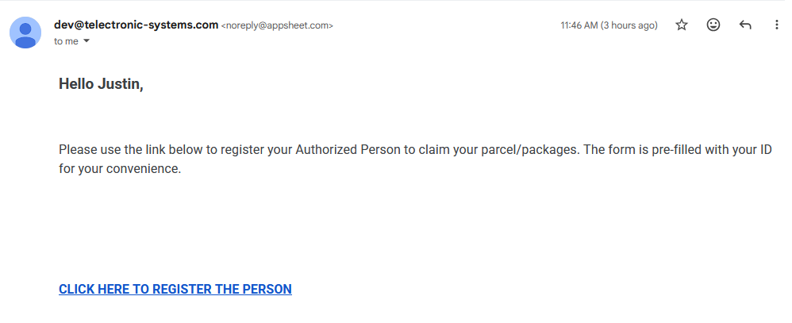
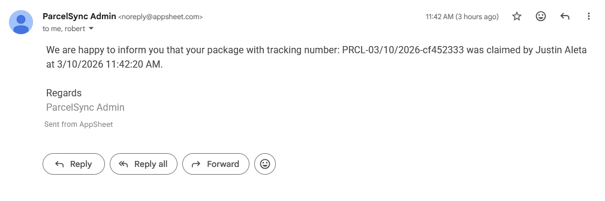

# 

## ParcelSync: Delivery Management System

**Version:** v1.7.1-alpha
**AppSheet Build:** 1.000349
**Date:** April 6, 2026
**Maintainer:** Justin Anthony A. Aleta

---

[Go to End User Documentation ➡️:](/docs/End-User%20Documentation.md)

---

## 1. Executive Summary

The ParcelSync is a mobile-first logistics and security tool designed to streamline package handling and visitor registration. It replaces manual logbooks with digital tracking, ensuring real-time data accuracy and automated tenant notifications.

## 2. Problem Statement

Manual logbooks at TSI/Bedoo properties created:

- Lost package incidents (illegible handwriting)
- Delayed tenant notifications (manual phone calls)
- No audit trail for security incidents
- Time-consuming guard shift handovers

## 3. Solution

Digital tracking system with:

- Real-time package status
- Automated SMS/email notifications
- Complete audit logs (who, when, what)
- Zero-setup guard handovers (cloud synced!)

## 4. User Roles & Workflows

| Role                 | Key Responsibilities                                      | Primary Interface                |
| :------------------- | :-------------------------------------------------------- | :------------------------------- |
| **Security Guard**   | Receive packages, release packages via QR, verify guests. | Mobile App (Scanner Mode)        |
| **Property Manager** | Oversee daily logs, manage tenant list, audit security.   | Desktop Dashboard                |
| **Tenant**           | Receive notifications, pre-register authorized guests.    | Email / Web Form (No App Access) |

## 5. Key Features

### A. Package Management (The "Guard Console")

- **Log Delivery:** Guard uses the "Add New" form to capture courier photos and auto-generate a `TrackingID`.
- **Release Package:** Guard uses the **Search Bar** to scan the Tenant's QR code. This filters the list to show only that tenant's unclaimed packages.
- **Data Source:** Linked to `delivery_logs` Google Sheet.

### B. Smart Scanning

- **Hardware:** Utilizes device camera via AppSheet mobile app.
- **Configuration:** `QRCode` column set to **Scannable** and **Searchable**.
- **Action Logic:** Uses `LINKTOROW([ID], "Guard Form")` to ensure scanning opens the specific record for editing, rather than creating a duplicate.

### C. Authorized Registration (Self-Service)

- **Workflow:** Manager sends a "Smart Link" to the Tenant via email automation.
- **Technology:** Google Form with URL Parameters (`entry.id=XXX`).
- **Automation:**
  1. Tenant clicks unique link in email.
  2. Google Form opens with `TenantID` pre-filled.
  3. Tenant submits Guest Name/Photo.
  4. AppSheet bot syncs response to `Authorized Persons` table.

### D. Notification Reminder

- **Workflow:** A notification will be sent to the owner and authorized persons reminding to claim the parcel for two days. Afterwards on day 3, it will be mark for return.
- **Technology:** Google AppSheet bots

### E. Arhciving Mechanism

- **Workflow:** After a month of storing delivery logs, the logs will be transferred to an archive sheet. Then pictures will be moved to trash. after 30 days, it will be permanently deleted.
- **Technology:** Google AppSheet and Google AppScript functions

### G. Weekly Report

- **Workflow:** Every after week, there is a report which will be sent to the property manager containing information about the delivery logs in the Building
- **Technology:** Google AppSheet

## 4. Technical Architecture

- **Platform:** AppSheet (Core), Google Sheets (Database), Google Forms.
- **Tables:**
  - `Tenants` (Master Data, Key: `TenantID`)
    - `delivery_logs` (Transactions, Ref: `TenantID`)
    - `Authorized Persons` (Child Table, Ref: `TenantID`)
    - `Incoming Authorized Persons` (Child Table, Ref: `TenantID`)
- **Security:**
  - **Guards:** View restricted to `Guard Console`.
    - **Managers:** Full access to `Admin Console`.

## 5. Screenshots

- **Security Package Logs**
  

- **Admin Dashboard**
  

- **Tenant List View**
  

- **Authorized Person List View**
  

- **Parcel Ready for Pickup Notification**
  

- **Authorized Person Notification**
  

- **Claimed Notification**
  
