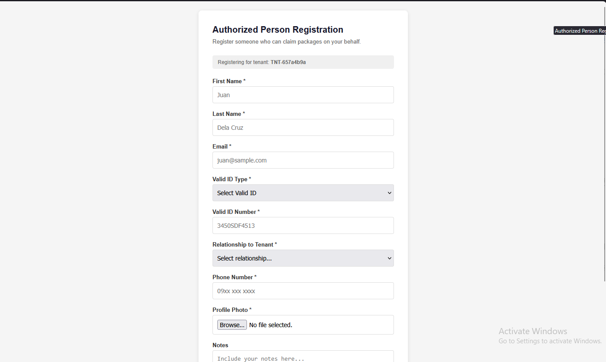

# End-User Documentation

**Version:** 1.000326 (MVP)
**Date:** March 31, 2026
**Maintainer:** Justin Anthony A. Aleta

**Target**: Condo Admins and Security Guards.

## A. User Roles

1. `Admin`: Responsible for vetting IDs and "Approving" authorized persons.

2. `Guard`: Responsible for "Adding" new parcels and "Claiming" them when residents arrive.

## B. Workflow Guides

### How to Add a Parcel: Step-by-step instructions for the Guard using the "Add Log" form

1. When the courier arrives, the guard first identify if the parcel is already paid or not a food.

2. If both are true, the guard logs the delivery providing the following details:
   - Courier Name
   - Deliver Person Name
   - Owner
   - Package Type
   - Size/Weight
   - Photo of the Parcel

3. After including all the details, once saved, it will automatically notify the owner as well as the authorized persons to claim the package.

### The Claim Process: How to find a parcel, click the "Claim" button, and select the verified person

1. When claiming, either the owner or the authorized person shall go to the guard to claim the package.

2. They should present the QR Pass and a valid ID to claim.

3. The Guard will scan the QR Code to search for the package.

4. Once it is found, select the person who is claiming and press "Save"

5. A notification will be sent to the owner and authorized persons letting them all know that the package is already claimed.

### Switching Accounts

1. Click `Change Account` on the bottom navigation.

2. Click the Edit icon floating on the bottom part of the screen in color `orange`

3. A form will open up, you have to provide the **4-digit PIN** number to verify identity. When there is a match, the name of the security guard will show at the bottom.

4. Click `Save` afterwards for sucessfull account switch

## C. Resident Experience

### Registration: How residents should fill out the Google Form for their Nannies/Helpers

1. A form will be sent by the admin so official tenant can register some authorized persons. Reference the image below:

   

2. The tenant shall fill out all important and essential details to official register the helper.

   

### Notifications

1. Parcel Ready for Pickup

   

2. Reminder to Pickup

   

3. Parcel already Claimed

   

4. Return notice

   

5. Delivery Log Weekly Report Notification

   

6. Archiving and Deleting Notification

   
